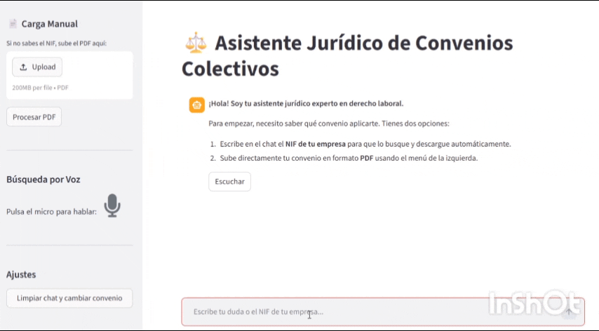
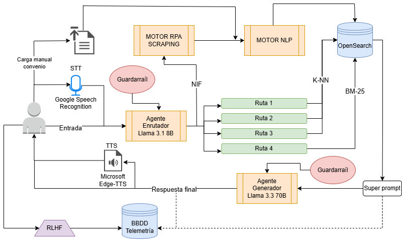
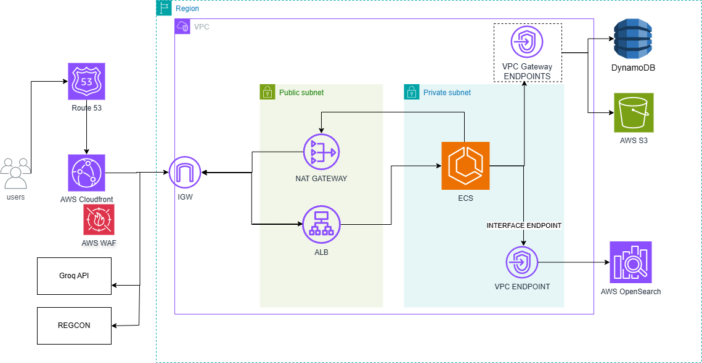
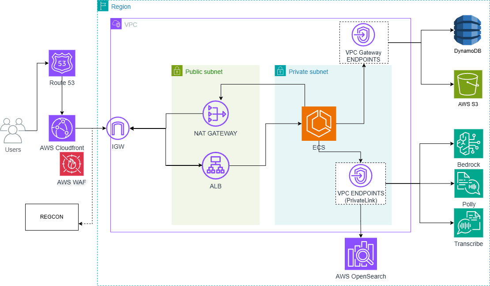

# Sistema RAG Híbrido Multimodal para Asistencia Jurídica en Convenios Colectivos

    



## Descripción del Proyecto
Este proyecto es el resultado de un Trabajo de Fin de Máster (TFM) especializado en Inteligencia Artificial. Consiste en una arquitectura avanzada de Generación Aumentada por Recuperación (RAG) diseñada para el dominio LegalTech. El sistema actúa como un asistente virtual capaz de procesar, indexar y consultar convenios colectivos españoles, ofreciendo respuestas fundamentadas, extracción literal de articulado y soporte multimodal (voz y texto).

### Flujo General del Sistema 


## Características Principales
* **Extracción automatizada (RPA):** Integración de un proceso headless mediante Selenium que navega por el portal gubernamental REGCON para descargar convenios colectivos en tiempo real a partir del NIF de una empresa.
* **Procesamiento PDF inteligente:** Implementación de algoritmos de chunking semántico que respetan la estructura legal del documento (títulos, capítulos, artículos) para preservar el contexto durante la vectorización.
* **Búsqueda híbrida:** Combinación de búsqueda densa (embeddings multilingües) y búsqueda dispersa (BM25) utilizando OpenSearch.
* **Multimodalidad:** Soporte de interacción por voz integrando modelos Speech-to-Text (Whisper) y Text-to-Speech (Edge-TTS) para la vocalización de respuestas.

## Ingeniería de IA y LLMOps
El sistema está diseñado pensando en el ciclo de vida del modelo de lenguaje (LLMOps) y su mantenimiento a largo plazo:

* **Enrutamiento de modelos (Model Routing):** Se utiliza un modelo rápido y de bajo coste (`llama-3.1-8b-instant`) tanto como guardarraíl inicial (para validar que el sistema tiene un convenio en memoria) como para clasificar la intención de la consulta mediante *Few-Shot Prompting*. Solo para la generación de la respuesta final y el razonamiento jurídico se invoca un modelo de gran capacidad (`llama-3.3-70b-versatile`).
* **Diseño de Caché cruzada computacional O(1):** El sistema inyecta metadatos clave (`nif_id` y `hash_id` vía SHA-256) en los fragmentos vectorizados. En un despliegue con base de datos duradera (como se plantea en la arquitectura Cloud), esta estructura de datos permite verificar la existencia previa de un convenio en tiempo constante, evitando disparar innecesariamente el motor RPA o el pesado pipeline de procesamiento NLP para consultas recurrentes.
* **Telemetría y preparación para RLHF:** El sistema traza el contexto recuperado, el prompt exacto y la respuesta generada. En la implementación actual (MVP), estos logs se persisten de forma asíncrona mediante un *Mock local* (`telemetria.json`), sentando las bases de la arquitectura objetivo que inyectará estos datos en Amazon DynamoDB para futuros procesos de *Reinforcement Learning from Human Feedback*.
* **Fundamentos para la Evaluación Continua (Drift):** Para evitar la degradación del sistema en producción, es necesario monitorizar el modelo. Lo implementado actualmente en el código es la capa base de observabilidad: un sistema de logging (`telemetria.json`) que captura el contexto exacto, el prompt del usuario y la salida generada. A nivel de diseño, la arquitectura contempla usar esta materia prima para aplicar un patrón *LLM-as-a-Judge* con métricas sin referencia como **RAGAS**, permitiendo evaluar asíncronamente la Fidelidad (*Faithfulness*) y Relevancia de la respuesta.

## Arquitectura del Software Desacoplada
El código fuente sigue el principio de responsabilidad única, dividiendo el sistema en los siguientes módulos dentro de la carpeta `src/`:
* `app.py`: Controlador principal, interfaz de Streamlit y gestión de estados de sesión.
* `scraping_convenios.py`: Módulo RPA tolerante a fallos para descargas oficiales.
* `procesador_texto.py`: Pipeline de limpieza, extracción de texto (PyMuPDF) y hashing.
* `bd_opensearch.py`: Cliente de conexión y lógica del clúster vectorial.
* `rag_agent.py`: Orquestador de ingeniería de prompts y cliente de la API de Groq.

## Arquitectura Cloud y Decisiones de Diseño (AWS)
El diseño de despliegue sigue los pilares del **AWS Well-Architected Framework**, garantizando el aislamiento de datos sensibles requerido en el sector LegalTech.

### Opción A: Despliegue Híbrido (MVP Cost-Optimized)

Diseñada como un Producto Mínimo Viable (MVP) enfocado en el *Time-to-Market* y la optimización de costes. El cómputo principal se ejecuta sin servidores mediante contenedores en **Amazon ECS (Fargate)**, aislados en una subred privada y protegidos en la capa de borde por un **Application Load Balancer (ALB)** acoplado a un **AWS WAF**. El tráfico exterior está estrictamente limitado: un **NAT Gateway** permite la salida de las peticiones RPA (Selenium) y la comunicación cifrada con la API de inferencia externa (Groq). Para la persistencia de datos (S3) y telemetría (DynamoDB), se implementan **VPC Gateway Endpoints** a nivel de enrutamiento interno, evitando sobrecostes por transferencia en el NAT.

### Opción B: Evolución Enterprise (100% AWS Native)

Arquitectura objetivo diseñada para cumplir con los máximos estándares de seguridad. El núcleo del cambio reside en la sustitución de las APIs externas por modelos fundacionales gestionados en **Amazon Bedrock** e IA de voz nativa (Transcribe/Polly). A nivel de red, la comunicación con estos servicios se realiza a través de **VPC Interface Endpoints (AWS PrivateLink)**, inyectando interfaces de red (ENIs) directamente en la subred privada. Esto garantiza que todo el flujo de Inteligencia Artificial viaje exclusivamente por la red troncal de AWS sin tocar internet público, asegurando una arquitectura *Zero Trust* y un *Compliance* absoluto frente al RGPD.

### Comparativa de Arquitecturas
| Característica | Opción A (Híbrida) | Opción B (Nativa) |
| :--- | :--- | :--- |
| **Inferencia LLM** | Groq API (Externa) | Amazon Bedrock (Interna) |
| **Privacidad de Datos** | Alta (TLS/SSL) | Extrema (VPC PrivateLink) |
| **Coste Operativo** | Bajo (Pago por uso Groq) | Medio/Alto (Bedrock Provisioned) |
| **Escalabilidad** | Alta (ECS Fargate) | Muy Alta (Serverless Native) |

## Requisitos e Instalación Local

### 1. Preparar el entorno

Es altamente recomendable utilizar un entorno virtual (venv) para aislar las dependencias del proyecto.
```bash
# 1. Clonar el repositorio
git clone [URL_DE_TU_REPOSITORIO]
cd [NOMBRE_DEL_DIRECTORIO]

# 2. Crear el entorno virtual
python -m venv venv

# 3. Activar el entorno virtual
# En Windows:
venv\Scripts\activate
# En macOS/Linux:
# source venv/bin/activate

# 4. Instalar las dependencias
pip install -r requirements.txt
